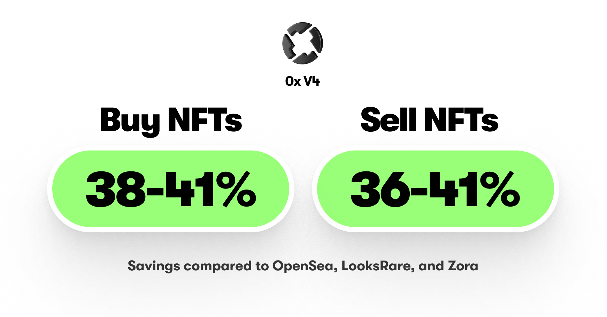
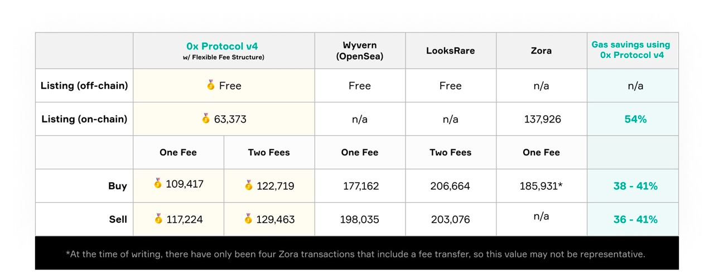

# 0x v4 Swap SDK

### Overview

Swapping with the Swap SDK just got even better. With the integration of 0x v4, swaps are now the cheapest available on Ethereum, giving developers' applications a competitive advantage. Both developers and users benefit from the 0x v4 upgrade.

#### About Swap SDK

Swap SDK allows developers to build NFT swap functionality into their Ethereum (or EVM-compatible chains) applications quickly and easily. Whether you're building a wallet, an NFT marketplace, or a peer-to-peer swap application, Swap SDK makes integrating NFT swap functionality easy and lightweight.

Swap SDK is a light, performant library built with [`ethers`](https://github.com/ethers-io/ethers.js/) to easily interact with the 0x v4 protocol. Swap SDK also offers a free, managed orderbook so you don't need to worry about building off-chain order persistance (unless you want to). Swap SDK provides all the functionality to build an NFT marketplace or peer-to-peer swap application, including building orders, approving orders, persisting orders, and filling orders. Just add a UI!

### ⛽  Gas Optimizations

> **0x v4 is the cheapest way to swap an NFT on Ethereum or any EVM-compatible chain.**



Whether you prefer on-chain or off-chain orders, 0x v4 is the cheapest and most efficient way to swap NFTs to date.



Since Swap SDK uses 0x v4 protocol under the hood, the Swap SDK is the the most gas-efficient and cheapest way to swap NFTs on Ethereum. Build your app confidently knowing you're offering your users the best swapping experience available.

Based on recent gas benchmarks, 0x v4 is significantly cheaper  to fill orders.

* **40% cheaper than OpenSea, LooksRare, and Rarible for buying NFTs**
* **35% cheaper than Zora to fill (>60% cheaper than Zora if including both parties' gas fees)**

0x v4 supports both on-chain listings and off-chain listings so you can choose the best approach for your application.

### 📩  Order Support

0x v4 initially includes a rich set of swap functionality. More swap functionality (e.g. bundles) will be added over time

* :white\_check\_mark: ERC721 <> ERC20 swap
* :white\_check\_mark: ERC1155 <> ERC20 swap

NFT buys and sells (bids and asks) are both supported.

Note: Currently 0x v4 does not support NFT<>NFT swaps (e.g. ERC721<>ERC721). If required, you can use the 0x v3 protocol until v4 support is added.

### Installation

You can install the SDK with yarn:

`yarn add @traderxyz/nft-swap-sdk`

or npm:

`npm install @traderxyz/nft-swap-sdk`

### Configuration

To use the SDK, create a new `NftSwapV4` instance.

```tsx
import { NftSwapV4 } from '@traderxyz/nft-swap-sdk';

// Supply a provider, signer, and chain id to get started
// Signer is optional if you only need read-only methods
const nftSwapSdk = new NftSwapV4(provider, signer, chainId);
```

Note: 0x v4 contracts with NFT support are currently only live on the Ropsten. Mainnet will be released to mainnet chains soon.

### Quick Start

Let's walk through the most common NFT swap case: swapping an NFT (ERC721 or ERC1155) with an ERC20.&#x20;

#### Swap an NFT with an ERC20

```typescript
import { NftSwapV4 } from '@traderxyz/nft-swap-sdk';

// Scenario: User A wants to sell their CryptoPunk for 420 WETH 

// Set up the assets we want to swap (CryptoPunk #69 and 420 WETH)
const CRYPTOPUNK = {
  tokenAddress: '0xb47e3cd837ddf8e4c57f05d70ab865de6e193bbb',
  tokenId: '69',
  type: 'ERC721', // 'ERC721' or 'ERC1155'
};
const FOUR_HUNDRED_TWENTY_WETH = {
  tokenAddress: '0x6b175474e89094c44da98b954eedeac495271d0f', // WETH contract address
  amount: '420000000000000000000', // 420 Wrapped-ETH (WETH is 18 digits)
  type: 'ERC20',
};

// [Part 1: Maker (owner of the Punk) creates trade]
const nftSwapSdk = new NftSwapV4(provider, signerForMaker, CHAIN_ID);
const walletAddressMaker = '0x1234...';
await nftSwapSdk.approveTokenOrNftByAsset(CRYPTOPUNK, walletAddressMaker);
const order = nftSwapSdk.buildOrder(
  CRYPTOPUNK, // Maker asset to swap
  FOUR_HUNDRED_TWENTY_WETH, // Taker asset to swap
  walletAddressMaker
);
const signedOrder = await nftSwapSdk.signOrder(order, takerAddress);

// [Part 2: Taker that wants to buy the punk fills trade]
const nftSwapSdk = new NftSwap(provider, signerForTaker, CHAIN_ID);
const walletAddressTaker = '0x9876...';
await nftSwapSdk.approveTokenOrNftByAsset(FOUR_HUNDRED_TWENTY_WETH, walletAddressTaker);
const fillTx = await nftSwapSdk.fillSignedOrder(signedOrder);
const fillTxReceipt = await nftSwapSdk.awaitTransactionHash(fillTx.hash);
console.log(`🎉 🥳 Order filled. TxHash: ${fillTxReceipt.transactionHash}`);
```

That's it! More examples and advanced usage can be found in the examples documentation.&#x20;

Happy swapping! :tada: :handshake:

