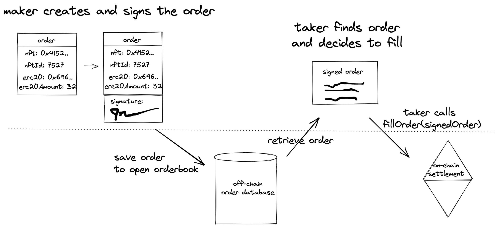

# Swap NFT <> ERC-20 Example

Let's swap a NFT (an [`ERC721`](https://eips.ethereum.org/EIPS/eip-721)) for USDC (an [`ERC20`](https://ethereum.org/en/developers/docs/standards/tokens/erc-20/)).


In this first example, we're going to do an ERC20<>NFT swap. We're going to swap User A's CryptoPunk NFT for 69 USDC.&#x20;

This is a common scenario on NFT marketplaces -- User A lists an NFT for sale in exchange for a certain amount of a token (commonly ETH or USDC). Anyone can fill the order (e.g. buy the NFT that is listed for sale) as long as they have enough token balance of the required token.

> **Terminology**: `maker`: Since User A will initiate the trade, we'll refer to User A as the `maker` of the trade.

> **Terminology**: `taker`: Since User B will be filling and completing the trade created by User A, we'll refer to User B as the `taker` of the trade.

```tsx
// Setup the sample data...
const CHAIN_ID = 1; // Chain 1 corresponds to Mainnet. Visit https://chainid.network/ for a complete list of chain ids

const CRYPTOPUNK_420 = {
  tokenAddress: '0xb47e3cd837ddf8e4c57f05d70ab865de6e193bbb', // CryptoPunk contract address
  tokenId: '420', // Token Id of the CryptoPunk we want to swap
  type: 'ERC721', // Must be one of 'ERC20', 'ERC721', or 'ERC1155'
};

const SIXTY_NINE_USDC = {
  tokenAddress: '0xA0b86991c6218b36c1d19D4a2e9Eb0cE3606eB48', // USDC contract address
  amount: '69000000', // 69 USDC (USDC is 6 digits)
  type: 'ERC20',
};

// User A Trade Data
const walletAddressUserA = '0x1eeD19957E0a81AED9a80f09a3CCEaD83Ea6D86b';
const nftToSwapUserA = CRYPTOPUNK_420;

// User B Trade Data
const walletAddressUserB = '0x44beA2b43600eE240AB6Cb90696048CeF32aBf1D';
const usdcToSwapUserB = SIXTY_NINE_USDC;

// ............................
// Part 1 of the trade -- User A (the 'maker') initiates an order
// ............................

// Initiate the SDK for User A.
// Pass the user's wallet signer (available via the user's wallet provider) to the Swap SDK
const nftSwapSdk = new NftSwap(provider, signerUserA, CHAIN_ID);

// Check if we need to approve the NFT for swapping
const approvalStatusForUserA = await nftSwapSdk.loadApprovalStatus(
  nftToSwapUserA,
  walletAddressUserA
);
// If we do need to approve User A's CryptoPunk for swapping, let's do that now
if (!approvalStatusForUserA.contractApproved) {
  const approvalTx = await nftSwapSdk.approveTokenOrNftByAsset(
    nftToSwapUserA,
    makerAddress
  );
  const approvalTxReceipt = await approvalTx.wait();
  console.log(
    `Approved ${assetsToSwapUserA[0].tokenAddress} contract to swap with 0x v4 (txHash: ${approvalTxReceipt.transactionHash})`
  );
}

// Create the order (Remember, User A initiates the trade, so User A creates the order)
const order = nftSwapSdk.buildOrder(
  nftToSwapUserA,
  usdcToSwapUserB,
  walletAddressUserA
);
// Sign the order (User A signs since they are initiating the trade)
const signedOrder = await nftSwapSdk.signOrder(order);
// Part 1 Complete. User A is now done. Now we send the `signedOrder` to User B to complete the trade.

// ............................
// Part 2 of the trade -- User B (the 'taker') accepts and fills order from User A and completes trade
// ............................
// Initiate the SDK for User B.
const nftSwapSdk = new NftSwap(provider, signerUserB, CHAIN_ID);

// Check if we need to approve the NFT for swapping
const approvalStatusForUserB = await nftSwapSdk.loadApprovalStatus(
  usdcToSwapUserB,
  walletAddressUserB
);
// If we do need to approve NFT for swapping, let's do that now
if (!approvalStatusForUserB.contractApproved) {
  const approvalTx = await nftSwapSdk.approveTokenOrNftByAsset(
    usdcToSwapUserB,
    walletAddressUserB
  );
  const approvalTxReceipt = await approvalTx.wait();
  console.log(
    `Approved ${assetsToSwapUserB[0].tokenAddress} contract to swap with 0x. TxHash: ${approvalTxReceipt.transactionHash})`
  );
}
// The final step is the taker (User B) submitting the order.
// The taker approves the trade transaction and it will be submitted on the blockchain for settlement.
// Once the transaction is confirmed, the trade will be settled and cannot be reversed.
const fillTx = await nftSwapSdk.fillSignedOrder(signedOrder);
const fillTxReceipt = await nftSwapSdk.awaitTransactionHash(fillTx);
console.log(`🎉 🥳 Order filled. TxHash: ${fillTxReceipt.transactionHash}`);
```


### Trade Lifecycle


